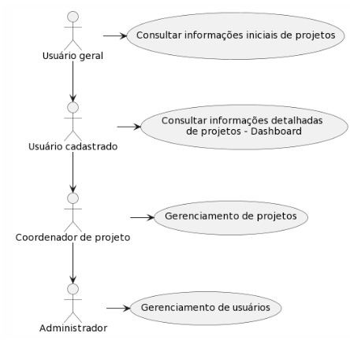
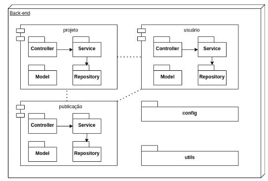
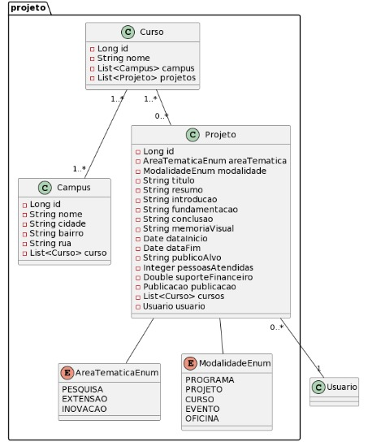
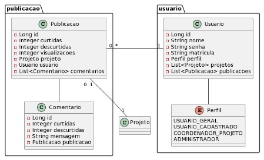

# Observatório de Projetos - Universidade de Pernambuco (Opupe - Backend) 🔭

## O que é? 🤷‍♂️
O observatório se apresenta como um instrumento de transparência com objetivo de proporcionar o compartilhamento de conhecimento e de apoiar a tomada de decisão diante do caos informacional vivenciado pelas organizações.

## Visão arquitetural 🏭
O observatório de projetos é uma aplicação web que utiliza tecnologias modernas tanto no front-end quanto no back-end. No front-end, são utilizados TypeScript e React, que são duas tecnologias amplamente utilizadas atualmente. Já no back-end é utilizado Java em conjunto com o framework Spring boot. Para movimentar informações entre as camadas, é utilizado o JSON (Javascript Object Notation).
[Link para o repositório front-end](https://github.com/kvojps/op_upe-front)

Ao utilizar essas tecnologias, o sistema oferece aos usuários uma experiência moderna e eficiente, enquanto mantém uma base sólida e robusta do lado do servidor. Diante disso, sendo capaz de oferecer aos usuários uma uma aplicação web rápida, escalável e confiável.

### Visão de casos de uso 👤
Há 04 (quatro) tipos de usuários que interagem com o observatório: usuário geral, usuário cadastrado, coordenador de projeto e administrador (figura 2). Cada um desses tipos de usuários têm diferentes usos para o sistema:
|  |
|:--:|
| Diagrama de casos de uso - Perfis do usuário |

Nesta seção serão denotados os principais casos de uso para cada perfil presente no sistema, para ter acesso ao documento com todos os requisitos do sistema acesse [Link para o repositório com as documentações](https://github.com/kvojps/tcc-engenharia-software)

Um usuário geral deve ser capaz de consultar a lista de projetos de pesquisa, extensão e inovação da universidade. Também deve ser possível filtrar os projetos por vários campos de interesse. Detalhe dos filtros:
* Por tipo (extensão, pesquisa, inovação), data específica de criação, ano de criação, ano de conclusão, nome (termos presentes no nome), proponente, autores/professores colaboradores, campus e curso.

Um usuário cadastrado e logado deve ser capaz de visualizar análises dos diversos aspectos dos projetos a partir de gráficos e tabelas para consolidação de dados. Alguns dos aspectos disponíveis nesta análise  são:
* Quantidade total de projeto e a quantidade de projetos por categoria(extensão, pesquisa e inovação), modalidade, campus, curso, ano de início e finalização.

Um coordenador de projeto deve ser capaz de adicionar um projeto para que seja possível consultá-lo no observatório.

Um administrador pode associar o perfil “Coordenador de Projeto” a um outro usuário. Este perfil pode apenas ser associado a pessoas que trabalham ou estudam na universidade.

### Visão lógica 🖖🏾
Os pacotes do back-end do sistema foram divididos por caso de uso, e inserido em cada caso de uso existem os pacotes de controlador, serviço, repositório e modelo. Além desses pacotes adicionais, existem os pacotes config e utils que possuem algumas configurações adicionais do sistema
| |
|:--:|
| Diagrama de pacotes - Back-end |

### Visão de implementação 🧑‍💻
Esta seção tem como objetivo apresentar o diagrama de classes do sistema em questão. Por meio dele será possível visualizar as entidades que compõem o sistema e seus relacionamentos. Estas são as principais entidades do observatório:
* Campus;
* Curso;
* Projeto;
* Usuário;
* Publicacão;
* Comentário;
  
|  |
|:--:|
| Diagrama de classes - Escopo Projeto |

|  |
|:--:|
| Diagrama de classes - Escopo Publicação |

#### Endpoints disponíveis 🟢
Em construção 🏗️